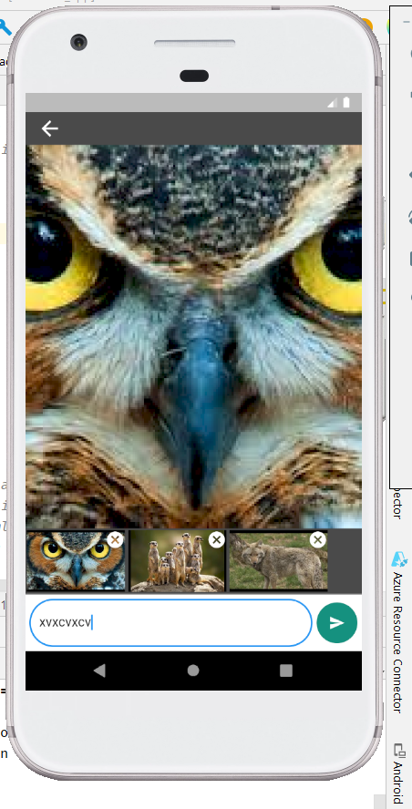

this package created  as a solution for comment with details & chat app chatbox 
## Features

* comments for **artical**
* comments for **news**
* chats box

## Getting started

_dart pub add info_with_comment_

## Usage

**_MessageView_** is the main interface designer
**_ManageComment_** is data like sub comment managing class, you can override it's propertis and methods you can give  you own implementation 
****_example_ :**** 

`    
   class CommentController extends ManageComment {
    
    Color mainCommentBoxColor  = kBlack;
    bool showBoxShadow =true;
    }`

#UI Implementation

`**class MyApp extends StatelessWidget {
        const MyApp({Key? key}) : super(key: key);
        
        // This widget is the root of your application.
        @override
        Widget build(BuildContext context) {
        return MaterialApp(
        debugShowCheckedModeBanner: false,
        title: 'Flutter Demo',
        theme: ThemeData(
        primarySwatch: Colors.blue,
        ),
        home: MessageView(
        currentUserId: "User002",
        commentController: CommentController(), // you can provide your own implement class
        childWidget: Container(),
        ),
        );
        }

**_you can give child as your own Ui part_**  (childWidget: Container(),)

## Additional information

*you can can comment with image text &react

* view commented Images

* multiple image can comment
  

* you can comment with image & text

**create by** : _R.M.E.G.B Rathanayaka_

**Email** : _rathnayakaegb.soft@gmail.com_